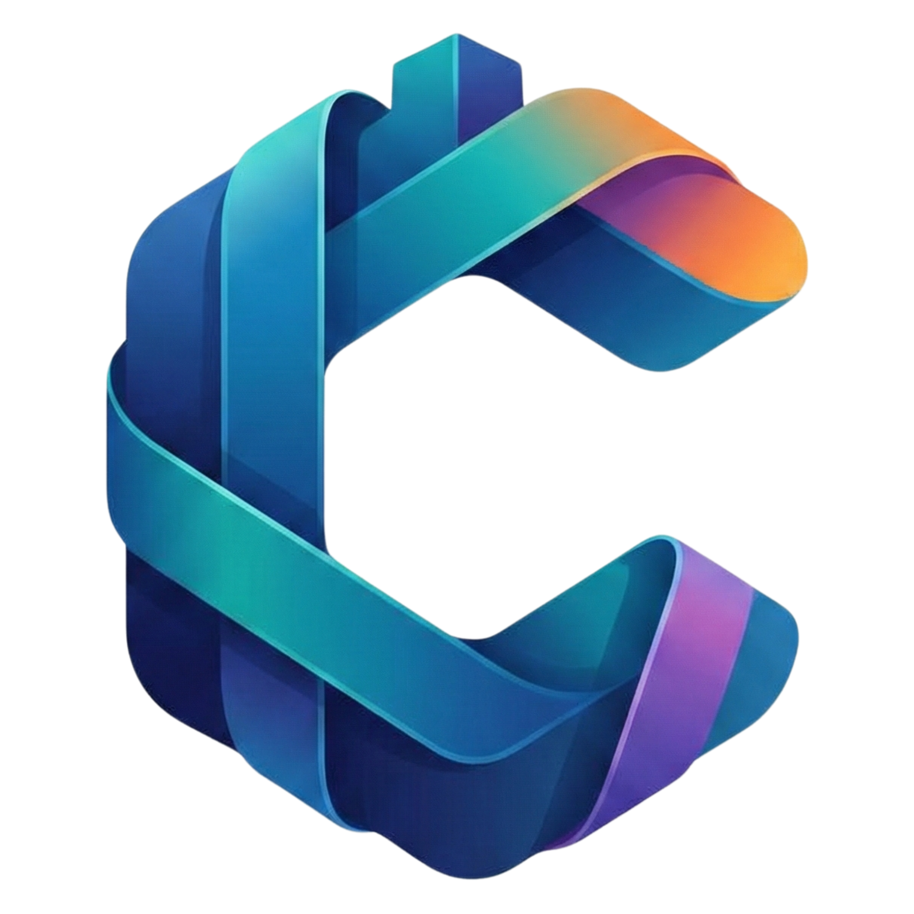

<p align="center">
  
</p>

<h1 align="center">Citadel Desktop</h1>

<p align="center">
  <strong>A hackable second brain for software developers.</strong><br/>
  Knowledge management, AI-powered writing, and deep code integration — all in one workspace.
</p>

<p align="center">
  <a href="https://github.com/citadel-app/citadel-desktop/releases/latest"></a>
  <a href="https://github.com/citadel-app/citadel-desktop/releases"></a>
  <a href="https://github.com/citadel-app/citadel-desktop/blob/main/LICENSE"></a>
</p>

---

## Download

Choose the installer for your platform. All binaries are unsigned — you may need to allow the app through your OS gatekeeper on first launch.

<!-- INSTALLERS:START -->
> No release installers available yet. They will appear here automatically after the first published release.
<!-- INSTALLERS:END -->

<details>
<summary><strong>Which file should I download?</strong></summary>

| Platform | Recommended | Notes |
|:---------|:------------|:------|
| **Windows** | `portable.exe` | No installation required — just download and run |
| **macOS (Apple Silicon)** | `arm64.dmg` | For M1/M2/M3/M4 Macs |
| **macOS (Intel)** | `x64.dmg` | For older Intel-based Macs |
| **macOS (Universal)** | `universal.dmg` | Works on both Apple Silicon and Intel |
| **Linux** | `.AppImage` | Portable, works on most distributions |
| **Linux (Debian/Ubuntu)** | `.deb` | Native package manager integration |

</details>

---

## Architecture

This repository is the **packaging and distribution shell** for [Citadel](https://github.com/citadel-app/citadel). It does not contain application source code — it consumes the pre-built `citadel-payload.zip` from the monorepo and wraps it with Electron Builder for each platform.

```
citadel (monorepo)          →  builds app code, publishes @citadel-app/app
  ↓ triggers
citadel-desktop (this repo) →  packages into platform installers, publishes releases
```

### Build Pipeline

1. A new release in `citadel-app/citadel` triggers the `Build Desktop App` workflow
2. The workflow downloads the latest `citadel-payload.zip` (containing the pre-built `out/` directory)
3. Electron Builder packages the payload into platform-specific installers across 3 OS runners
4. All artifacts are uploaded to a draft GitHub Release for review

### Auto-Updates

Production builds support auto-updates via `electron-updater`. The updater checks this repository's releases for new versions and downloads full binary replacements.

---

## Development

```bash
# Install dependencies
npm install --legacy-peer-deps

# Build for your platform
npm run build:win    # Windows
npm run build:mac    # macOS (universal)
npm run build:linux  # Linux
```

> **Note:** You need the `citadel-payload.zip` extracted into `./out/` before building. See the [monorepo](https://github.com/citadel-app/citadel) for build instructions.

---

## License

[MIT](LICENSE) © Citadel
